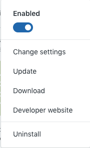
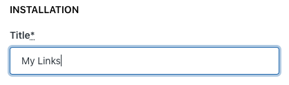
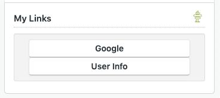
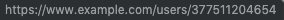

[](LICENSE)
[](https://travis-ci.com/Ibotta/url_builder_app)
[](https://codeclimate.com/repos/5d9242ca2d833400b1000180/maintainability)
[](https://codeclimate.com/repos/5d9242ca2d833400b1000180/test_coverage)
[](.github/CODE_OF_CONDUCT.md)

# URL Builder App V2

## Description:

A Zendesk App to help you generate links for agents.

## Changes from V1 to V2
We've included some helpful information about what has changed in the V2 of this app in our [Wiki](https://github.com/Ibotta/url_builder_app/wiki/Changes-from-V1-to-V2)

## Usage Instructions:

1. Navigate to the Zendesk Marketplace and find "URL Builder App V2".
2. Click "Install".
3. Similarly, you can reach this screen by going to your installed apps, and clicking "Change Settings".



4. Select your account to install the app.
5. Confirm the title; this will display in the URL Builder App box above the links:



6. The second box is for the URLS, and uses an array of JSON, described below. In this example, note we are using a placeholder `{{ticket.requester.id}}`.


7. Optionally enable role restrictions if these URLs are not appropriate for all agents.
8. Once your JSON is in place, click `Install`.
9. Open a new browser to test your results.



If we highlight the `User Info` link, we see the placeholder `ticket.requester.id` has been replaced with ticket requester's ID of `377511204654`.



## JSON Array of URLs:

The following is an example of what can be entered into this app's settings:

```javascript
[
  {
    "title": "First Title",
    "url": "http://example.com/?name={{ticket.requester.name}}"
  },
  {
    "title": "Second Title (with custom field)",
    "url": "http://example.com/?custom={{ticket.custom_field_424242}}"
  }
]

```
This example will generate the following HTML inside the app:
```html
<ul>
  <li>
    <a href="http://example.com/?name=Robert C.Martin">First Title</a>
  </li>
  <li>
    <a href="http://example.com/?custom=secretRocketLaunchCodes">Second Title (with custom field)</a>
  </li>
</ul>
```

----
### Available Placeholders
* {{ticket.id}} //not available for new tickets
* {{ticket.description}}
* {{ticket.requester.id}}
* {{ticket.requester.name}}
* {{ticket.requester.email}}
* {{ticket.requester.externalId}}
* {{ticket.requester.firstName}}
* {{ticket.requester.lastName}}
* {{ticket.requester.user_fields.YYY}} = custom user fields can be used
* {{ticket.assignee.user.id}}
* {{ticket.assignee.user.name}}
* {{ticket.assignee.user.email}}
* {{ticket.assignee.user.externalId}}
* {{ticket.assignee.user.firstName}}
* {{ticket.assignee.user.lastName}}
* {{ticket.assignee.group.id}}
* {{ticket.assignee.group.name}}
* {{ticket.custom_field_XXXXXXX}} // XXXXXXX = custom field id
* {{ticket.organization.organization_fields.XXXXXXX}} // XXXXXXX = Field key, default is field name
* {{currentUser.id}}
* {{currentUser.name}}
* {{currentUser.email}}
* {{currentUser.externalId}}
* {{currentUser.firstName}}
* {{currentUser.lastName}}

## Issues
To submit an issue, please follow the [available template](/.github/ISSUE_TEMPLATE.md).

## Contribution

Improvements are always welcome. To contribute, please submit detailed Pull Requests following the [guidelines](/.github/CONTRIBUTING.md).