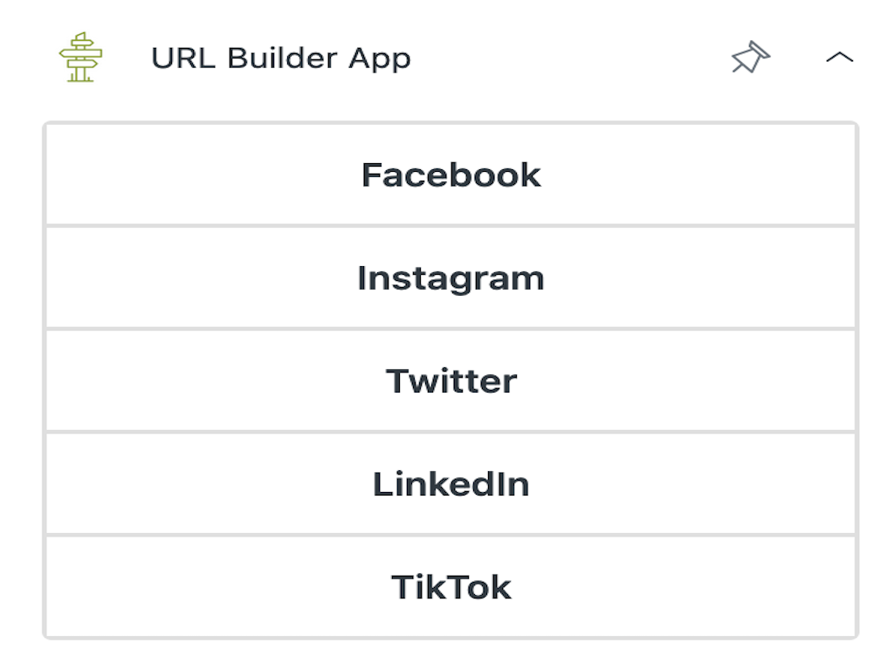
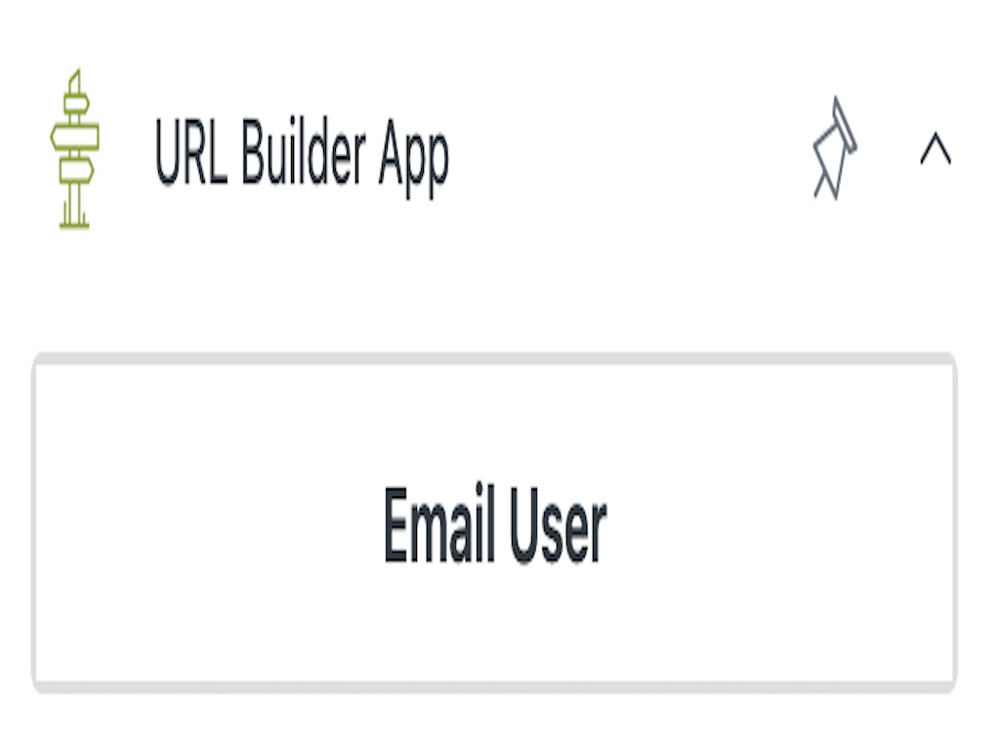
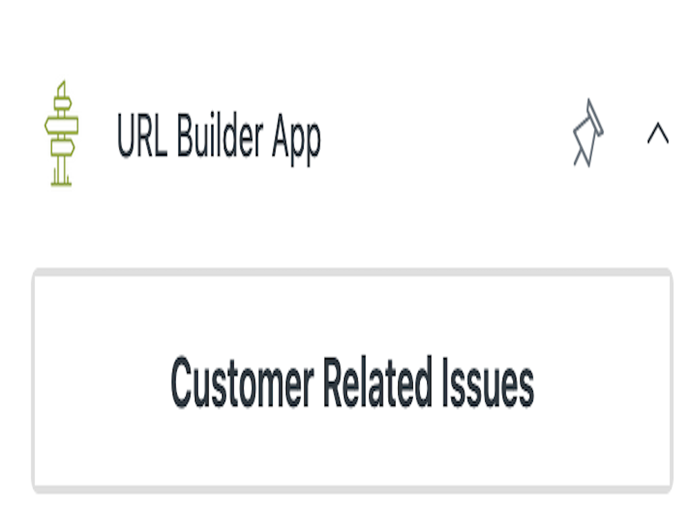

[](https://github.com/Ibotta/url_builder_app/actions/workflows/build.yaml)
[](LICENSE)
[](code_of_conduct.md)

# URL Builder App V3

**NOTE: This app is not currently on the Zendesk Marketplace. ** . Please follow the [Usage Instructions](#usage-instructions) to use this in your Zendesk domain.

A Zendesk App to help you generate links for agents.

## Dependencies
```
"node": ">=20.17.0",
"@zendesk/zcli": "^1.0.0-beta.51"
```

## Usage 
### Deploying from ZIP

Attached to the latest release is the `app-<DATE>.zip` asset that can be [uploaded to your Zendesk instance](https://developer.zendesk.com/documentation/apps/getting-started/uploading-and-installing-a-private-app/#uploading-and-installing-a-private-app-in-zendesk):

1. In Admin Center, click the Apps and integrations, click Zendesk Support Apps.
2. Click Upload private app.
3. Enter the App Name.
4. Click Choose File and select the zip file.
5. Click Upload.
6. In the pop-up box that appears, click Agree and upload this App.
7. When prompted, click Install.

#### Build, Test, and Upload

If you are interested in extending the app or simply building from source, check out the [CONTRIBUTING](./.github/CONTRIBUTING.md#compile-and-deploy-from-source) docs.

### Changing Settings

Once the app is uploaded, you can Install it to the configured areas of Zendesk.  You can update the JSON array by entering the Zendesk Admin Center > Apps & Integrations > Private Apps > (Whatever you named the app, or URL BuildeR app V3 by default).

### Configuring the JSON Array of URLs

To configure the URL buttons, you must supply a JSON array of URLs with `title` and `url` properties.  Here is an example:

```javascript
[
    {
        "title": "Facebook",
        "url": "https://www.facebook.com"
    },
    {
        "title": "Instagram",
        "url": "https://www.instagram.com"
    },
    {
        "title": "Twitter",
        "url": "https://www.twitter.com"
    },
    {
        "title": "LinkedIn",
        "url": "https://www.linkedin.com"
    },
    {
        "title": "TikTok",
        "url": "https://www.tiktok.com"
    }
]
```

This will yield the following display:



### Using Zendesk Object Properties

Below is a list of just a few of the available object properties available as placeholders. To see the full list of fields, please see the [Zendesk Apps Reference - API Reference](https://developer.zendesk.com/api-reference/apps/introduction/). For example, you can use object properties available in [all locations](https://developer.zendesk.com/api-reference/apps/apps-support-api/all_locations/) and object properties available in the [ticket sidebar](https://developer.zendesk.com/api-reference/apps/apps-support-api/ticket_sidebar/).

```
* {{ticket.id}}
* {{ticket.description}}
* {{ticket.requester.id}}
* {{ticket.requester.name}}
* {{ticket.requester.email}}
* {{ticket.requester.user_fields.YYY}} = custom user fields can be used
* {{ticket.assignee.user.id}}
* {{ticket.assignee.user.name}}
* {{ticket.assignee.user.email}}
* {{ticket.custom_field_XXXXXXX}} // XXXXXXX = custom field id
* {{ticket.organization.organization_fields.XXXXXXX}} // XXXXXXX = Field key, default is field name
* {{currentUser.id}}
* {{currentUser.name}}
* {{currentUser.email}}
```

Here is an example configuration of a URL button that has the email of the user:

```javascript
[
    {
        "title": "Email User",
        "url": "mailto:{{ticket.requester.email}}"
    }
]
```

This generates the following button:

We can highlight this button and see the following URL:



### Using Custom Fields in URLs

Zendesk allows for [custom fields](https://support.zendesk.com/hc/en-us/articles/4420210121114-Using-custom-fields) to be added in various places like Users, Tickets, and Organizations for Zendesk Admins.  These custom fields can be used in your URLs as well.  

For example, let's say we use the custom field for the customer like `Issue Topic`, a drop down where they pick their issue type.  When a custom field is created, you will see a column for the `Field ID` generated and you can copy it for the URL. If this object has an ID of `1234567890`, it can be used in a URL like so:

```javascript
[
  {
    "title": "Customer Related Issues",
    "url": "http://example.com/issues?customer_id={{ticket.requester.id}}&issue_type={{ticket.custom_field_360371540635070}}"
  }
]
```

Given an issue type of "new feature", this would generate a URL with the values set:



An important note here is that URLs generated by custom fields are not updated dynamically.  If the custom field is on the Agent side for example and is updated, the page will need to be refreshed to update the URLs.

## Issues

To submit an issue, please follow the [available template](/.github/ISSUE_TEMPLATE.md).

## Contribution

Improvements are always welcome. To contribute, please submit detailed Pull Requests following the [guidelines](/.github/CONTRIBUTING.md).